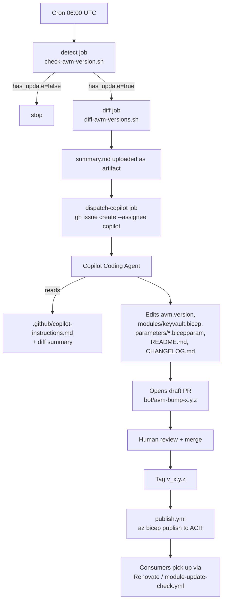
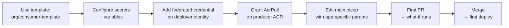

# Copilot POC — Design (As Implemented)

> Status of the PoC across the two repositories that make up the end-to-end
> automation. This document describes what is **actually built today**, where
> the PDF vision is fully realized, and where there are gaps still to close.

## 1. What this POC is

An automation that keeps the organization's **Key Vault shared Bicep module**
permanently in sync with upstream Microsoft AVM releases — without anyone on
the platform team having to babysit it. When a new
`br/public:avm/res/key-vault/vault` version drops, the system picks it up,
diffs it, asks GitHub Copilot's coding agent to apply the bump under a fixed
set of guardrails, validates it in a sandbox subscription, and ships a PR to
the team for sign-off. Once merged and tagged, the module is published to the
private ACR where downstream application repos consume it.

## 2. Two repositories, one pipeline

```
┌──────────────────────────────────────┐         ┌──────────────────────────────────────┐
│  agentic-automation-producer         │         │  agentic-automation-consumer         │
│  (this repo)                         │         │                                      │
│                                      │         │                                      │
│  • Owns modules/keyvault.bicep       │ publish │  • main.bicep pins                   │
│  • Tracks avm.version                 │────────►│    br/shared:keyvault-shared:<ver>   │
│  • Runs the AVM-update automation    │   ACR   │  • Renovate / scheduled poll opens   │
│  • Publishes to ACR on tag           │         │    PRs to bump the pinned version    │
└──────────────────────────────────────┘         └──────────────────────────────────────┘
```

- **Producer** is the system-of-record for the wrapper. It is the thing the
  PDF describes.
- **Consumer** is a reference implementation that proves the published module
  is usable by downstream app repos and that the ACR-tag bump path works the
  same way (Renovate or a scheduled workflow opens a PR).

## 3. Producer repo layout

```
agentic-automation-producer/
├── avm.version                              ← single source of truth (semver)
├── modules/keyvault.bicep                   ← AVM wrapper with locked-down defaults
├── parameters/keyvault.example.bicepparam   ← sample input used by validation
├── tests/deploy.validation.sh               ← bicep build/lint + what-if (+optional deploy)
├── scripts/
│   ├── check-avm-version.sh                 ← compares avm.version vs registry tags
│   └── diff-avm-versions.sh                 ← compiles old/new + emits diff + summary.md
├── .github/
│   ├── copilot-instructions.md              ← guardrails the coding agent MUST follow
│   └── workflows/
│       ├── avm-update-automation.yml        ← detect → diff → open Copilot issue
│       ├── pr-validate.yml                  ← PR-triggered build/lint/what-if
│       └── publish.yml                      ← on v*.*.* tag → bicep publish to ACR
├── CHANGELOG.md
└── README.md
```

## 4. End-to-end flow



### 4.1 Detect (`avm-update-automation.yml` → `detect`)

Runs daily on cron and on demand via `workflow_dispatch`. Calls
[`scripts/check-avm-version.sh`](scripts/check-avm-version.sh), which hits the
public MCR registry tags endpoint
(`mcr.microsoft.com/v2/bicep/avm/res/key-vault/vault/tags/list`), filters to
strict semver, and emits `current`, `latest`, `has_update` to
`$GITHUB_OUTPUT`.

### 4.2 Diff (`avm-update-automation.yml` → `diff`)

Only runs if `has_update == true`. Calls
[`scripts/diff-avm-versions.sh`](scripts/diff-avm-versions.sh), which compiles
both module versions through `az bicep build` and produces three artifacts:

- `params.diff.json` — added / removed / changed parameters
- `outputs.diff.json` — added / removed / changed outputs
- `summary.md` — Markdown summary used as the issue body

These are uploaded as the `avm-diff` workflow artifact.

### 4.3 Dispatch to Copilot

A GitHub issue is opened, assigned to `@copilot`, with:

1. The diff summary inline.
2. An explicit list of the four files the agent is allowed to touch.
3. A pointer to [`.github/copilot-instructions.md`](.github/copilot-instructions.md),
   which encodes the **hard constraints** that must never be violated:
   - `enableRbacAuthorization: true`
   - `enablePurgeProtection: true`
   - `softDeleteRetentionInDays: 90` (locked: `@minValue(90) @maxValue(90)`)
   - `publicNetworkAccess: Disabled` (default)
   - `networkAcls.defaultAction: Deny` (default)
   - No silent renames/removals of wrapper parameters; deprecate first.
   - Workflows and scripts are **off-limits** to the agent.

### 4.4 Copilot makes the change

The coding agent edits only the four target files (`avm.version`,
`modules/keyvault.bicep`, optionally
`parameters/keyvault.example.bicepparam`, plus `README.md` and `CHANGELOG.md`),
runs `az bicep build` / `az bicep lint` locally, and opens a **draft** PR on a
branch named `bot/avm-bump-<new-version>`.

### 4.5 Validation

[`tests/deploy.validation.sh`](tests/deploy.validation.sh) runs `bicep build`,
`bicep lint`, and `az deployment group what-if` against the sandbox RG, with
optional real deploy when `DEPLOY=true`.

It is wired to CI by
[`.github/workflows/pr-validate.yml`](.github/workflows/pr-validate.yml),
which runs on every PR that touches `avm.version`, `modules/**`,
`parameters/**`, `tests/deploy.validation.sh`, or `scripts/**`. The job
logs into Azure via OIDC, executes the script, uploads the log as a
`validation-log` artifact, and posts a pass/fail comment back on the PR.
A `workflow_dispatch` input (`deploy: true`) flips it from what-if to a
real sandbox deploy.

### 4.6 Publish (`publish.yml`)

Triggered when a maintainer pushes a tag `v<major>.<minor>.<patch>` after the
PR merges. Authenticates to Azure via OIDC, validates the tag is strict semver,
and runs:

```
az bicep publish \
  --file modules/keyvault.bicep \
  --target br:${ACR_NAME}.azurecr.io/keyvault-shared:${VERSION} \
  --with-source
```

`avm.version` (the upstream pin) and the consumer's pinned tag (the wrapper
version) are intentionally decoupled — the wrapper can iterate independently
of the AVM cadence.

## 5. Consumer repo layout

```
agentic-automation-consumer/
├── bicepconfig.json                       ← `shared` alias → private ACR
├── main.bicep                             ← pins br/shared:keyvault-shared:<ver>
├── parameters/main.bicepparam
├── .github/
│   ├── renovate.json                      ← Renovate watches the OCI tag
│   └── workflows/
│       ├── deploy.yml                     ← PR what-if + push-to-main deploy (OIDC)
│       └── module-update-check.yml        ← daily ACR poll → opens bump PR
└── README.md
```

Two redundant bump paths intentionally:

- **Renovate** (preferred) — handles the OCI tag datasource and groups under
  the `shared key vault module` label.
- **`module-update-check.yml`** (fallback) — for environments where Renovate
  isn't installed; uses `az acr repository show-tags` + `gh pr create`.

The deploy workflow keeps the contract simple for app teams: edit
`main.bicep`/`parameters/`, open a PR, get a what-if; merge to `main`, get a
deployment.

## 6. PDF requirement coverage

| # | PDF requirement | Status | Notes |
|---|---|---|---|
| 1 | Copilot watches for AVM Key Vault releases | ✅ | Cron + `check-avm-version.sh` against MCR `v2/.../tags/list` |
| 2 | Understands the change diff | ✅ | `diff-avm-versions.sh` compiles both versions and emits `params.diff.json`, `outputs.diff.json`, `summary.md` |
| 3 | Intelligently updates wrapper + example only where applicable | ✅ | Copilot Coding Agent driven by `.github/copilot-instructions.md` and the diff summary |
| 4 | Validates by deploying to a sandbox | ✅ | `pr-validate.yml` runs `tests/deploy.validation.sh` (build + lint + what-if) on every PR via OIDC; `workflow_dispatch` toggles a real deploy |
| 5 | Enforces governance via SCF policy compliance | ❌ Gap | Referenced in `copilot-instructions.md` ("CI pipeline will additionally run … SCF policy compliance scan") but no `az policy state list` step exists in any workflow |
| 6 | Self-documents parameter changes in README | ✅ | Step 6 of the agent instructions; `CHANGELOG.md` entry under the new version is also required |
| 7 | Opens a PR, summarizes, notifies the team | ✅ | Copilot opens the PR; Teams Adaptive Cards posted from `avm-update-automation`, `pr-validate`, and `publish` (gated on `secrets.TEAMS_WEBHOOK_URL`) |

### Tech-stack coverage

| Component | PDF says | Implemented |
|---|---|---|
| IaC | Azure Bicep | ✅ |
| Module standard | Azure Verified Modules | ✅ (`br/public:avm/res/key-vault/vault:0.11.0`) |
| Automation engine | GitHub Actions | ✅ |
| Copilot integration | Copilot Coding Agent | ✅ (`@copilot` assignee + `copilot-instructions.md`) |
| Azure deployment | `az deployment` | ✅ (validation + consumer deploy) |
| Compliance check | `az policy state` | ❌ |
| Notification | Teams webhook / GH mentions | ✅ (both: GH issue/PR mentions + Teams Adaptive Cards on detect, PR validate, and publish) |
| Documentation | Auto-generated README | ✅ |
| Version detection | Bicep public registry API | ✅ |

## 7. Known gaps / next steps

1. **SCF policy compliance step.** Add a `compliance` job to
   `pr-validate.yml` that runs after the sandbox deploy:
   ```bash
   az policy state list \
     --resource-group "$SANDBOX_RESOURCE_GROUP" \
     --filter "ComplianceState eq 'NonCompliant'" \
     --query "[?contains(policyDefinitionAction,'deny') || contains(policyDefinitionAction,'audit')]"
   ```
   Fail the job on any non-compliant result.
2. **Branch protection / CODEOWNERS.** Not in scope for the PDF, but worth
   adding so the human review step in the flow is enforced rather than
   conventional.

## 8. Scaling to N consumer repositories

The reference consumer (`agentic-automation-consumer`) carries its own copy of
every workflow, config, and bot script. That's fine for one repo and useful
for the demo, but it does not scale to dozens of app teams. The target shape
when this rolls out broadly is **thin consumers + centrally owned automation**.

### 8.1 What every consumer repo MUST have (thin footprint)

| File | Purpose | Owned by |
|---|---|---|
| `bicepconfig.json` | Defines the `shared` alias for the private ACR | App team (one-time) |
| `main.bicep` (or equivalent) | Pins `br/shared:keyvault-shared:<ver>` and supplies its own params | App team |
| `parameters/<env>.bicepparam` | Per-environment input | App team |
| `.gitignore` | Ignore `*.bicep.json` build artifacts | App team |
| `.github/CODEOWNERS` | Platform team owns `main.bicep` pin line + `bicepconfig.json` | App team + Platform |

That's the entire hand-written surface area. Everything below is referenced
centrally so version bumps to the automation don't require touching every
consumer repo.

### 8.2 What every consumer repo MUST configure (one-time)

**Repo secrets** (federated identity, no long-lived credentials):

| Secret | Used for |
|---|---|
| `AZURE_CLIENT_ID` | OIDC login as a UAMI/SP with `Contributor` on the target RG and `AcrPull` on the producer ACR |
| `AZURE_TENANT_ID` | Tenant |
| `AZURE_SUBSCRIPTION_ID` | Target subscription |
| `TEAMS_WEBHOOK_URL` *(optional)* | App-team channel for deploy notifications |

**Repo variables:**

| Var | Example |
|---|---|
| `ACR_NAME` | `adusasharedmodules` |
| `RESOURCE_GROUP` | `rg-orders-dev` |
| `LOCATION` | `eastus2` |

**Federated credential** on the deployer identity, scoped to
`repo:<org>/<consumer>:ref:refs/heads/main` and
`repo:<org>/<consumer>:pull_request`.

**ACR RBAC** — grant the deployer identity `AcrPull` on the producer ACR
(one assignment per app-team principal, or use a single platform UAMI shared
across consumers).

### 8.3 What lives centrally (write once, reused by all consumers)

To avoid copy-pasting YAML into every repo, three things move out of the
consumer repo and into shared locations:

1. **Reusable deploy workflow** — published from the **producer** repo as
   `.github/workflows/consumer-deploy.yml` and called by each consumer:
   ```yaml
   # consumer repo: .github/workflows/deploy.yml (3 lines)
   jobs:
     deploy:
       uses: <org>/agentic-automation-producer/.github/workflows/consumer-deploy.yml@v1
       secrets: inherit
   ```
   The reusable workflow encapsulates: OIDC login → ACR login → `bicep
   build` → `what-if` on PR → `deployment group create` on push-to-main →
   Teams webhook on result. App teams can't drift from the standard.

2. **Org-level Renovate config** — placed in `<org>/.github` repo's
   `renovate.json` (or via a Mend Renovate org install). One config covers
   all consumer repos with the `keyvault-shared` package rule, schedule, and
   labels. Individual repos do **not** need their own `renovate.json`.

3. **Org-level Copilot instructions** — `<org>/.github/copilot-instructions.md`
   defining how the Copilot Coding Agent should review Renovate bump PRs in
   any consumer (run what-if, summarize the parameter delta, request review
   if it sees a `// DEPRECATED:` parameter being removed in the new version).

### 8.4 Optional per-repo additions

These are pure opt-in; the platform team doesn't require them:

- **`module-update-check.yml`** — fallback poll/PR script for repos in orgs
  that don't run Renovate. Ships as a callable workflow from the producer
  repo so consumers just reference it.
- **Per-environment workflow matrix** — `dev` / `tst` / `prd` jobs in the
  reusable deploy workflow, gated on environment protection rules.
- **PR-level Teams notifications** — same Adaptive Card pattern used in the
  producer; only useful if the app team wants its own channel pinged.

### 8.5 Onboarding a new consumer repo

End-to-end, onboarding looks like:



`org/consumer-template` is a GitHub template repo derived from
`agentic-automation-consumer`, stripped down to just the five files in §8.1
plus a 3-line `deploy.yml` that calls the reusable workflow. Time to a
working pipeline for a new app team is minutes, not days.

### 8.6 What this gives you at scale

- **One PR fans out to N consumers** — bumping `keyvault-shared` in the
  producer triggers a Renovate PR in every consumer simultaneously. No
  manual coordination.
- **Single point of control** — security/platform updates the reusable
  workflow once; every consumer picks it up on the next run (or on a tag
  bump, depending on the `@<ref>` consumers pin).
- **Audit trail** — every consumer deployment carries the same
  `keyvault-shared:<ver>` tag, traceable back to a producer release, which
  is traceable back to an AVM version, which is traceable back to a Copilot
  bump issue.
- **Blast radius is bounded** — a bad wrapper change is caught by the
  producer's `pr-validate.yml` before it's ever published to ACR, so
  consumers are never exposed to a broken module.

> **Today's reference consumer is intentionally "fat" for the demo.** The
> production rollout flips that: each app team's repo shrinks to ~5 files,
> with the rest pulled from `<org>/agentic-automation-producer` and
> `<org>/.github`.

## 9. Why this design

- **One source of truth (`avm.version`)** keeps the wrapper, the workflow,
  and the agent in agreement on what "current" means without parsing Bicep.
- **Guardrails as a checked-in markdown file** (`copilot-instructions.md`)
  rather than prompt strings inside the workflow — the security team can
  review and PR-edit the rules just like any other code.
- **Producer/consumer split** mirrors how the wrapper will actually be used
  in production (a platform team owns the producer; many app teams own
  consumer repos), and lets us prove the ACR pinning + Renovate bump path
  end-to-end before rolling out.
- **Decoupled wrapper version vs. AVM version** lets the wrapper iterate
  (e.g., add an optional pass-through parameter) without forcing a
  no-op AVM bump.
